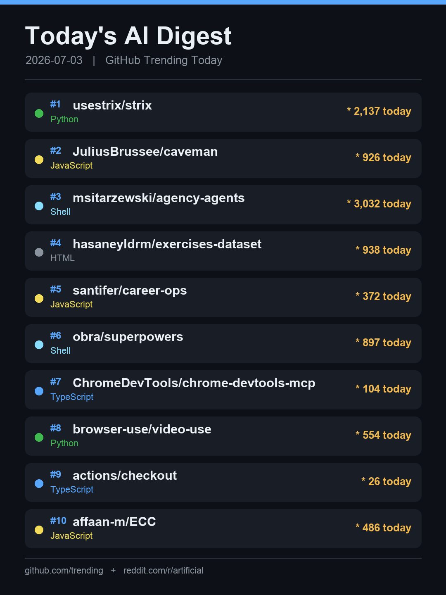

<div align="center">

# ☀️ AI News Digest Bot

**Your AI/dev news, curated every morning — straight to Telegram.**

Fetches the day's most interesting repos from **GitHub Trending** and hot posts from
**Reddit r/artificial**, renders a clean summary card, and delivers a tidy digest to your
Telegram chat. Zero servers required — run it locally, on cron, or with **GitHub Actions**.

[](https://www.python.org/)
[](LICENSE)
[](examples/github-actions.yml)
[](#contributing)



</div>

---

## ✨ Features

- 🔥 **GitHub Trending** — top daily repos with language + stars-today.
- 🟠 **Hacker News** — front-page stories ranked by points (official Algolia API).
- 💬 **Reddit r/artificial** — hot posts via the RSS feed (works where the JSON API is blocked).
- 🖼️ **Auto-generated card image** — a dark, shareable summary card (ASCII-safe, renders on any font).
- 📨 **Telegram delivery** — photo + HTML digest with real source links, no link-preview spam.
- 🌏 **Auto-translation, free** — English source text is translated to your language (Korean by default) via Google Translate — no API key, no cost. Set `LANG_DIGEST=en` to keep originals.
- ⏰ **Set-and-forget** — ship it on GitHub Actions cron and never think about it again.
- 🔒 **Secret-safe** — token & chat id live in env vars, never in code.

## 📸 What you get

Every morning your bot sends **a summary card** followed by a **linked digest**:

```
☀️ Today's AI Digest — 2026-07-03

🔥 GitHub Trending
1. msitarzewski/agency-agents · Shell · ★3,032
   A complete AI agency of specialized expert agents.
2. usestrix/strix · Python · ★2,137
   Open-source AI penetration-testing tool.
...

💬 Reddit r/artificial
• Independent benchmark shows big drops on Claude Fable 5 ...
• OpenAI in talks to give the Trump administration a 5% stake ...

📌 One-liner
Today's theme: agent frameworks + token efficiency, while
trust & governance debates heat up in parallel.
```

## 🚀 Quick start

### 1. Create a Telegram bot
1. Message [@BotFather](https://t.me/BotFather) → `/newbot` → copy the **token**.
2. Send your new bot any message, then grab your **chat id**:
   ```bash
   curl -s "https://api.telegram.org/bot<TOKEN>/getUpdates" | grep -o '"id":[0-9]*' | head -1
   ```

### 2. Run it
```bash
git clone https://github.com/<you>/ai-news-digest-bot.git
cd ai-news-digest-bot
pip install -r requirements.txt

cp .env.example .env        # then edit .env
export BOT_TOKEN="123456:ABC..."
export CHAT_ID="7518530902"

python digest.py
```

That's it — check your Telegram. 🎉

## ⏰ Run it every morning

### Option A — GitHub Actions (recommended, free)
1. Fork this repo.
2. Add repo **Secrets** → `BOT_TOKEN` and `CHAT_ID`
   (*Settings → Secrets and variables → Actions*).
3. Copy [`examples/github-actions.yml`](examples/github-actions.yml) to `.github/workflows/digest.yml`
   (the GitHub web UI *Actions → new workflow* creates it in one click). It runs daily at
   **23:00 UTC (08:00 KST)** — adjust the `cron` to your timezone.

### Option B — local cron
```cron
# 8:00 AM every day
0 8 * * *  cd /path/to/ai-news-digest-bot && /usr/bin/python3 digest.py >> digest.log 2>&1
```

## ⚙️ Configuration

| Env var       | Required | Default | Description                          |
|---------------|:--------:|:-------:|--------------------------------------|
| `BOT_TOKEN`   | ✅       | —       | Telegram bot token from @BotFather   |
| `CHAT_ID`     | ✅       | —       | Target chat id                       |
| `LANG_DIGEST` | ❌       | `ko`    | Digest body language: `ko` or `en`   |

## 🧠 How it works

```
GitHub Trending (scrape)  ─┐
Hacker News (Algolia API) ─┼─►  build card (Pillow)  ─►  sendPhoto  ─┐
Reddit r/artificial (RSS) ─┘                                        ├─►  Telegram
                              build HTML digest        ─►  sendMessage ┘
```

Reddit's JSON API returns `403` to non-browser clients, so this bot reads the public
**Atom RSS feed** instead — reliable and dependency-free. The card image sticks to ASCII
text on purpose, so it never renders as tofu boxes on systems without CJK/emoji fonts.

## 🤝 Contributing

PRs welcome! Ideas: more sources (Hacker News, arXiv, Product Hunt), Slack/Discord delivery,
themeable cards, per-source filters. Open an issue to discuss.

## 📄 License

MIT © contributors. See [LICENSE](LICENSE).

---

<div align="center">
<sub>If this saved you a morning scroll, consider leaving a ⭐ — it helps other people find it.</sub>
</div>
